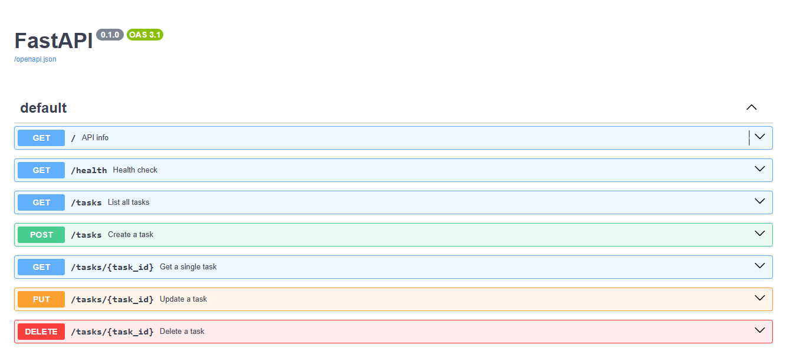

# Task API

A simple CRUD API for managing a to-do list, built with FastAPI as part of the FlyRank Backend Internship (Week 2).

Tasks are stored in memory only, restarting the server resets the list back to the 3 example tasks. There is no database yet.

## How to run it

1. Clone this repo and navigate to this folder:
```
   cd BE-02/CRUD API
```
2. Create and activate a virtual environment:
```
   python -m venv venv
   venv\Scripts\activate
```
3. Install dependencies:
```
   pip install -r requirements.txt
```
4. Start the server:
```
   uvicorn main:app --reload
```
5. Visit `http://localhost:8000` in your browser, or `http://localhost:8000/docs` for the interactive Swagger UI.

## Endpoints

| Method | Path            | Description                          |
|--------|-----------------|---------------------------------------|
| GET    | `/`             | API info                              |
| GET    | `/health`       | Health check                          |
| GET    | `/tasks`        | List all tasks (supports `?done=` and `?search=` filters) |
| GET    | `/tasks/{id}`   | Get a single task by id               |
| POST   | `/tasks`        | Create a new task                     |
| PUT    | `/tasks/{id}`   | Update a task's title and/or done status |
| DELETE | `/tasks/{id}`   | Delete a task                         |

## Example request

## Example request

```powershell
Invoke-RestMethod -Uri "http://localhost:8000/tasks/1" -Method GET
```

Response:
```
id title    done
-- -----    ----
 1 Buy milk False
```

## Swagger UI

