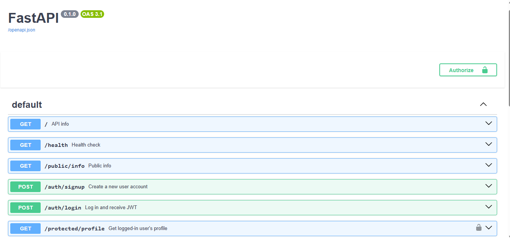
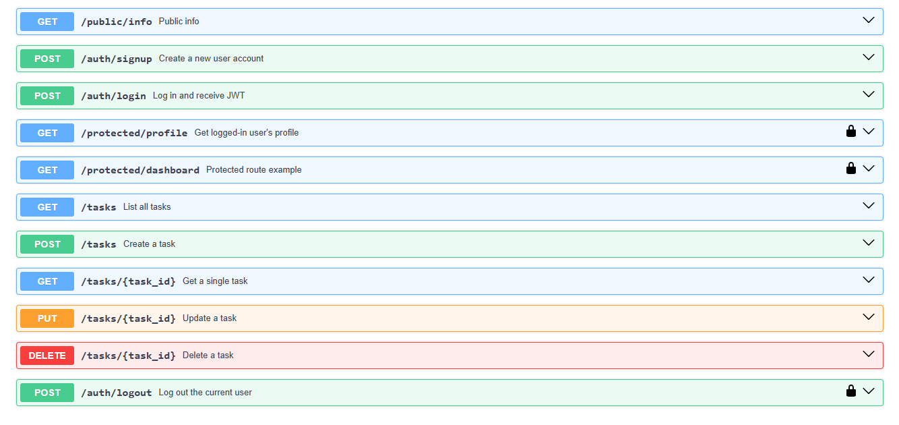
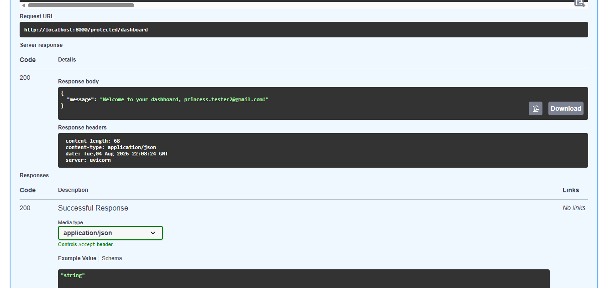

# Auth: Login & Protect

A secure FastAPI backend that handles user authentication using Supabase Auth as the Identity Provider. It supports sign up, log in, and log out, and protects specific routes so they only respond to authenticated users with a valid JSON Web Token (JWT).

Builds on an earlier CRUD API by adding an authentication layer: users must sign up and log in through Supabase, and certain routes are only accessible with a valid access token.

## How it works

1. A client signs up or logs in by sending an email and password to this API.
2. This API forwards those credentials to Supabase Auth (never storing or hashing passwords itself).
3. Supabase verifies the credentials and returns a JWT (access token).
4. The client attaches that token to future requests as an `Authorization: Bearer <token>` header.
5. This API verifies the token with Supabase before allowing access to protected routes.

## Setup

### 1. Clone the repo and navigate to this folder
```powershell
git clone https://github.com/AdekolaPrincess/FlyRank.git
cd FlyRank/BE-04
```

### 2. Create a virtual environment and activate it
```powershell
python -m venv venv
.\venv\Scripts\Activate.ps1
```

### 3. Install dependencies
```powershell
pip install -r requirements.txt
```

### 4. Set up environment variables
Copy `.env.example` to `.env`:
```powershell
Copy-Item .env.example .env
```
Then open `.env` and fill in your own Supabase project values:
SUPABASE_URL=your_supabase_project_url
SUPABASE_KEY=your_supabase_anon_key
PORT=8000

You can get these from your Supabase project dashboard under **Project Settings → API**. Use the **anon/public key** — never the `service_role` key.

**Important:** in your Supabase dashboard, go to **Authentication → Sign In / Providers → Email** and turn **off** "Confirm email" so newly signed-up users can log in immediately without needing to click a confirmation email (fine for local testing; you'd leave this on in production).

### 5. Run the server
```powershell
uvicorn main:app --reload --port 8000
```

The API will be running at `http://localhost:8000`, and interactive docs at `http://localhost:8000/docs`.

## API Reference

| Method | Route | Purpose | Requires Auth Token? |
|--------|-------|---------|----------------------|
| POST | `/auth/signup` | Create a new user account | No |
| POST | `/auth/login` | Log in and receive a JWT (access + refresh token) | No |
| POST | `/auth/logout` | End the current user's session | Yes |
| GET | `/protected/profile` | Get the logged-in user's profile | Yes |
| GET | `/protected/dashboard` | Example second protected route | Yes |
| GET | `/public/info` | Open, public info — no login required | No |

For protected routes, send the token as: Authorization: Bearer <your_access_token>

## Swagger UI

Visit `http://localhost:8000/docs` to see interactive documentation. Protected routes show a lock icon. Click **Authorize**, paste your access token (no need to type "Bearer " — Swagger adds that automatically), and use **Try it out** on any route.





