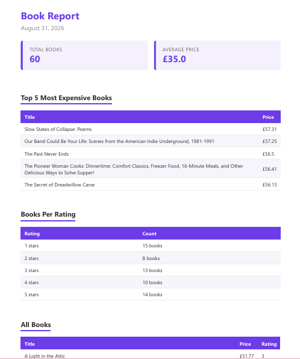
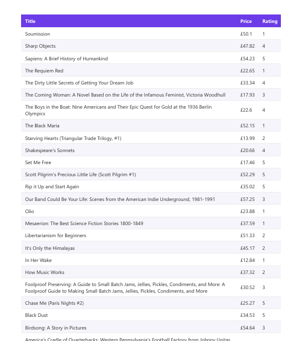

# PDF Report Generator

A backend API that generates a real PDF report from data stored in a SQLite database. The API queries the data, renders it into a styled HTML page, prints that page to a PDF using a headless browser, saves the file to disk, and serves it back by link.

## Dataset

This project uses real data: 60 book records scraped from books.toscrape.com in an earlier scraping assignment. The data lives in `books.json` and is loaded into a local SQLite database (`report.db`) by the seed script.

## How to run it

1. Create and activate a virtual environment

```powershell
python -m venv venv
.\venv\Scripts\Activate.ps1
```

2. Install dependencies

```powershell
pip install -r requirements.txt
playwright install chromium
```

3. Seed the database

```powershell
python seed.py
```

This reads the book data and inserts it into `report.db`. Running it more than once will not create duplicates, it clears the table first every time.

4. Run the API

```powershell
uvicorn main:app
```

The server runs at `http://localhost:8000`.

Note: this must be run without the `--reload` flag. On Windows, `--reload` can force a different internal event loop that is incompatible with how Playwright launches its browser process.

## Endpoints

- `GET /health` returns a simple status check
- `POST /reports` runs the full pipeline (query, render, save) and returns the new report's id and file link
- `GET /reports/{id}` returns the report's stored details, or 404 if the id does not exist
- `GET /reports/{id}/file` downloads the actual PDF file

## The aggregation SQL

These four queries turn the raw rows into the numbers shown in the report.

Total number of books:

```sql
SELECT COUNT(*) FROM books
```

Average price:

```sql
SELECT AVG(price) FROM books
```

Top 5 most expensive books:

```sql
SELECT title, price FROM books ORDER BY price DESC LIMIT 5
```

Number of books per star rating:

```sql
SELECT rating, COUNT(*) FROM books GROUP BY rating
```

## Proof it works

Generating a report:

```powershell
Invoke-RestMethod -Uri http://localhost:8000/reports -Method Post
```

Response:
`id file`
`3 /reports/3/file`


Downloading the file:

```powershell
Invoke-WebRequest -Uri http://localhost:8000/reports/3/file -OutFile my-report.pdf
```

This downloads a real, multi page PDF built from the live data in report.db.

## Why this runs inside the request, and when that would change

Report generation happens directly inside the POST /reports endpoint rather than in a background job, so the request takes a few seconds to respond while the PDF is built. For one user generating one report at a time, this is fine. If reports grew much larger, or many users generated them at once, I would move this work into a background job so the user is not left waiting on one slow request.

## Idempotency, one request, one report

Calling POST /reports twice on the same day returns the same report id and does not create a second file, unless the request explicitly includes force: true. This check protects against a user double clicking generate, or an app retrying a slow request, from silently creating duplicate reports. A real world example of why this matters: an order confirmation system without a check like this could email a customer the same receipt twice if a checkout request gets resubmitted, which at best looks sloppy and at worst makes it look like they were charged twice.

## Screenshot

Page 1 of a generated report:


